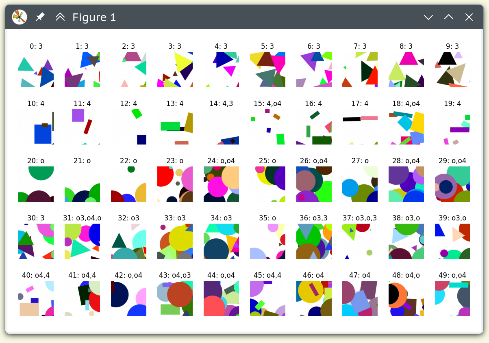

# slow.iam

## iklssfr — simple image classifier

```
make install
make demo
```




## ireqs — image index and search

> PostgreSQL database v16+ with pgvector extension is required.


### index

```
python3 -m ireqs.index --save-img --save-dir data/demo/caps --database '…' --detector=face 'data/demo/index/'
```

## search
```
python3 -m ireqs.query --show --database '…' --detector=face 'data/demo/query.jpg'
```


## toolz

+ qc.py
+ o34.py
+ ddg.py
+ vthmbs.sh
